## Table of Contents

- [Introduction ](#introduction)
- [Items Included ](#items-included)
- [Installation Instructions ](#installation-instructions)
- [Configuring IP Address ](#configuring-ip-address)
- [Detection App ](#detection-app)
  - [Initialization ](#initialization)
    - [Camera mounting ](#camera-mounting)
    - [Frame ](#frame)
    - [AI Models ](#ai-models)
  - [Image ](#image)
    - [Source ](#source)
    - [Orientation ](#orientation)
    - [Region of Interest ](#region-of-interest)
    - [Intensity ](#intensity)
    - [Color Mask ](#color-mask)
  - [Detection Algorithms  ](#detection-algorithms )
    - [Ellipse ](#ellipse)
    - [Polygon ](#polygon)
    - [Contour ](#contour)
    - [Aruco ](#aruco)
    - [OCR ](#ocr)
    - [Bar Code ](#bar-code)
    - [Object Detection ](#object-detection)
    - [Image Classification ](#image-classification)
  - [Settings ](#settings)
    - [2D Limit ](#2d-limit)
    - [3D Limit ](#3d-limit)
    - [6D Pose ](#6d-pose)
    - [Output Format ](#output-format)
  - [Results ](#results)
    - [Parameters ](#parameters)
    - [API Call ](#api-call)
    - [Return ](#return)
  - [Helper Functions ](#helper-functions)
    - [Pixel to XYZ  ](#pixel-to-xyz)
- [Upgrade the Software ](#upgrade-the-software)
- [Troubleshooting and Resolving Common Issues ](#troubleshooting-and-resolving-common-issues)


# Introduction
In this guide, we introduce the Dorna Vision Kit and cover the fundamentals of using vision in automation projects.

# Items Included
<p align="center">
  
</p>

1. 3D camera and mounting plate 
2. Vision kit computer
3. Ethernet cable
4. Power supply
5. Cable guide brackets
6. USB cable

# Installation Instructions

1. **Attach the Camera**  
   Mount the camera and its plate onto the robot. Align the two holes on the mounting plate with the holes on the robot’s 5th axis body and secure them. Make sure the camera plate is straight and not tilted.
   <p align="center">
   
   </p>

2. **Route the USB Cable**  
   Plug the USB cable into the robot's USB port. Ensure the screws on the USB connector are securely fastened to prevent loose connections.

3. **Connect the USB Cable to the Vision Kit**  
   Pass the USB cable to the vision kit and insert it into one of the blue USB 3.0 ports (blue USB ports).
   <p align="center">
   
   </p>

4. **Organize the USB Cable**  
   Use the cable guides to route the USB cable neatly. Ensure the cable does not obstruct the robot’s movement or become tangled.
   <p align="center">
   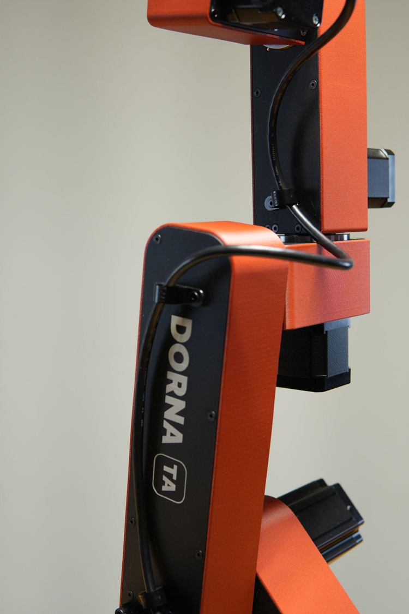
   </p>
   <p align="center">
   
   </p>
5. **(Optional) Set Up the Ethernet Splitter**  
   - To minimize the number of Ethernet cables running between devices, use the Ethernet splitter.  
   - Place the robot controller, vision kit, and splitter close together for easy connection.  
   - Connect the robot controller and vision kit to the splitter using the provided short Ethernet cables. Plug these cables into the two Ethernet ports on the splitter (the side with two ports).  
   - Power the splitter by connecting its USB cable to one of the gray USB 2.0 ports on the vision kit.

6. **Connect the Vision Kit to the Ethernet network**  
   Connect the Vision Kit to your Ethernet network using the Ethernet cable to connect it to your computer or router. If you have set up an Ethernet splitter, connect an Ethernet cable from the single-port side of the splitter to your computer or router.


7. **Power the Vision Kit**  
   Connect the USB-C power supply cable to the vision kit computer and plug the other end into a wall outlet.

> 🚨 **Notice:** Ensure all connections, including the camera and cables, are properly set up before turning on the vision kit.

# Connect to the Vision Kit

The vision kit is equipped with a single-board computer running a 64-bit Debian-based Linux distribution to execute your vision applications. The default hostname, username, and password for the vision kit are as follows:

```bash
# hostname
vision

# username
dorna

# password
dorna
```

## Configuring IP Address

If the vision kit is connected to a router with a DHCP server, the IP address will be automatically assigned. If it is connected directly to your computer via the Ethernet port, you will need to manually configure the IP address.

1. **SSH into the Vision Kit**  
   Open a terminal and use the following command to SSH into the vision kit (log in with the password `dorna`):

    ```bash
    ssh dorna@vision.local
    ```

2. **Open the Network Configuration Tool**  
   Type the following command to open the network configuration interface:

    ```bash
    sudo nmtui
    ```

3. **Edit the Connection**  
   - Select `Edit a connection`.
   - Choose the relevant connection type (e.g., `Wired connection 1`).

4. **Configure the IPv4 Settings**  
   - Set `IPv4 CONFIGURATION` to `Manual`.
   - Enter the following details:
     - `Address`: Assign a static IP address to the vision kit (e.g., `192.168.1.100`).
     - `Gateway`: Enter the gateway address (typically your router's IP address, e.g., `192.168.1.1`).
     - `DNS`: Use a DNS server address, such as `8.8.8.8` (Google's public DNS).

5. **Save the Configuration**  
   - Click `OK` to save your settings.
   - Press <Back> and then <OK> to exit the configuration tool.

6. **Reboot the Vision Kit**  
   Type `sudo reboot` to reboot the vision kit and apply the changes.

> 🚨 **Note:** If the vision kit is connected to a router with a DHCP server, the IP address will be assigned automatically by the router.

## Accessing Dorna Lab
To access the Dorna Lab software, enter the vision kit's IP address in your web browser by typing 
```bash
http://vision_kit_ip_address
```  
To connect to a robot from the Dorna Lab session, follow these steps:
1. Click on `Settings` in the top navbar.
2. Go to `General Info`.
3. Under `Robot System IP`, enter the robot's IP address.
4. Click `Set`.

# Detection App

The vision kit comes with a built-in **detection app** software which lets you to visually build your vision applications directly from a web browser. The detection app  generates the necessary API calls for you. You can then use these generated calls within your code to perform object detection, simplifying the process and integrating detection capabilities seamlessly into your applications.

To access the detection app, navigate to:
```bash
http://vision_kit_ip_address:8888/doc/workspaces/auto-g/tree/Downloads/vision/example/detection_app.ipynb
```

Alternatively, access Dorna Lab via the Vision Kit, open a new Python3 kernel in Jupyter Notebook and run the following code:
```python
%matplotlib widget
from dorna_vision import Detection_app
x = Detection_app()
```
</p>
<p align="center">

</p>

## Initialization
The first tab in the detection app is called Initialization.

</p>
<p align="center">
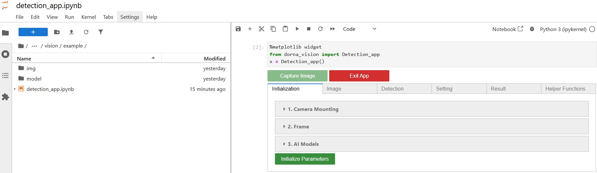
</p>

### Camera mounting
Start by selecting the type of camera setup under `Mounting setup`:

1. **Eye-in-hand**: In this configuration, the camera is mounted directly on the robot. This gives the robot a dynamic, real-time view from the tool or gripper’s perspective.
2. **Eye-to-hand**: Here, the camera is fixed in place and not attached to the robot, providing a static view of the workspace.

The default setup for the Dorna Vision Kit is eye-in-hand.
To function correctly in the eye-in-hand setup, the vision processor needs to know the robot’s exact position when each image is captured. This requires communication between the robot controller and the vision processor. You can enter the robot’s IP address here to enable that communication. To translate coordinates from the camera’s frame to the robot’s frame, the system uses a set of predefined transformation vectors. These vectors are already configured in the Vision processor and should not be modified, as doing so could cause errors in coordinate calculations.


</p>
<p align="center">

</p>

> 🚨 **Note:** The eye-in-hand configuration only works for the Dorna TA model.

### Frame
The `Frame` defines the coordinate system used to report the positions of detected objects. All detected positions are expressed relative to this frame. You can define a frame using a the `[x, y, z, a, b, c]` values of a 6D pose: `x, y, z` for the frame’s position (translation), and `a, b, c` for its orientation (rotation angles). The way this frame is defined depends on the camera setup:

#### Eye in hand:
When the camera is mounted on the robot, its position in space constantly changes. So, the frame should be defined relative to the robot's base. 

</p>
<p align="center">
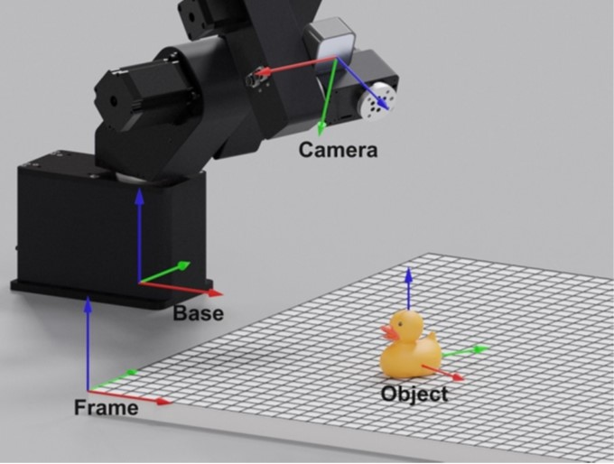
</p>

The default frame of `[0,0,0,0,0,0]` means all object positions are reported relative to the robot base — which is ideal for most applications.

</p>
<p align="center">

</p>


#### Eye to hand: 

When the camera is fixed in space (not on the robot), the frame must be defined relative to the camera using a 6D pose vector: `[x, y, z, a, b, c]`. If no frame is specified, all reported positions will default to the camera’s internal coordinate system, centered between its two lenses.


### AI Models
AI Models allows us to use AI to identify features, patterns, or objects of interest in images. This can be useful when you need to identify complex things within an image, such as scene context, specific objects, or text, and use that information to make decisions. To enable this feature, select either `Object detection` or `Image classification` from the `Detection method` dropdown, and provide the path to your AI model in the `Model path` field.

</p>
<p align="center">

</p>

If you do not want to use AI Models, you can also leave the `Model path` in blank and use classic Computer Vision algorithms instead. 

After finishing setting this section according to our needs, you must click on `Initialize Parameters` to initialize the Vision system. If everything was done correctly, you should see an image captured by the camera.

</p>
<p align="center">
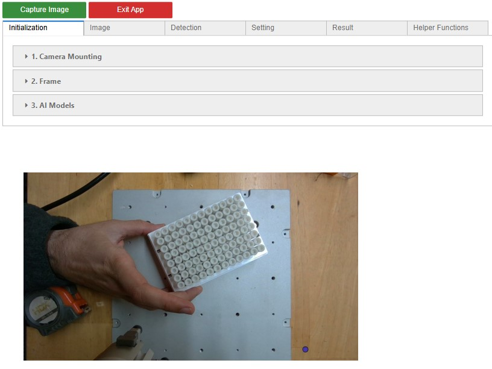
</p>

> 🚨 **Note:** After the Vision system has been successfully initialized, the Camera Mounting, Frame, and AI Models parameters will no longer be modifiable, and a new initialization will be needed to change them. All the parameters that will be discussed next will remain modifiable after the camera has been initialized.

## Image
The next is the Image tab. Here, the input source can be chosen, and you can use some simple image filters to modify the input image, preparing it for the detection algorithm. 

### Source 
You can either use your stereo camera as the input image source, or you can use an image file when testing your detection algorithm. If `File` is selected, the exact address for the file must be introduced in `File path`.
</p>
<p align="center">

</p>

### Orientation
This allows you to rotate the image clockwise in increments of 90° using the `Clockwise rotation` dropdown.

<div align="center">

<table>
  <tr>
    <td></td>
    <td>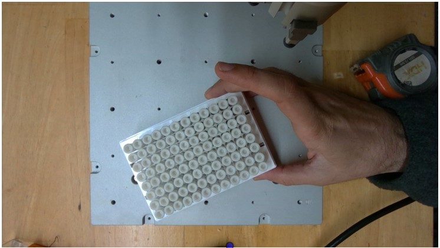</td>
  </tr>
  <tr>
    <td align="center">Original image</td>
    <td align="center">Image rotated 180°</td>
  </tr>
</table>

</div>

> 🚨 **Note:** Due to the plotting utility used, the image may appear stretched in the display depending on the orientation, but the image is processed by the Vision system maintaining its original aspect ratio.

### Region of Interest 
You can define a Region of Interest (ROI) to limit the area where the vision system looks for objects. This is especially useful when similar-looking objects appear in areas you want to ignore—like the background or regions that have already been processed. To set the ROI, use the polygon tool provided in this section. Click on the image to place the points that form the polygon. You can add as many points as needed, and each point can be dragged to reshape or reposition the polygon. The ROI has the following parameters:

- `Apply ROI`: Must be checked for the ROI settings to take effect.
- `Invert Region`: When checked, the vision system will focus on everything outside the polygon, ignoring the inside.
- `Crop`: If checked, the detection algorithm will only receive the pixels contained within a bounding box tangent to our ROI’s polygon. This is especially helpful for AI models, as it increases the relevance of the image content and improves detection performance.
- `Offset`: Expands the region slightly outside the polygon. Useful if you want to center your ROI around a point or line.


</p>
<p align="center">

</p>

> 🚨 **Note:** After the ROI polygon is closed, a list with the pixel coordinates of all the polygon’s corners will be displayed in the ROI box.

### Intensity
You can adjust the image’s `Contrast` and `Brightness`. Tweaking these settings helps improve image quality, making it easier for the detection algorithm to identify objects accurately. This is especially useful for adapting to different lighting conditions in the environment where the camera is used.

<div align="center">

<table>
  <tr>
    <td></td>
    <td></td>
  </tr>
  <tr>
    <td align="center">Original image</td>
    <td align="center">Image with Contrast 0.84 and Brightness 63</td>
  </tr>
</table>

</div>


> 🚨 **Note:** `Contrast` and `Brightness` settings that work well under specific lighting conditions may not work as well under other ones. To ensure performance consistency, it's recommended to ensure that the lighting conditions are the same every time the Vision system is used.

### Color Mask 
This feature works similarly to the `Region of interest` — both are used to include or exclude certain parts of the image so that the detection algorithm only processes relevant areas. With Color Masking, pixels are included or excluded based on their HSV values (Hue, Saturation, and Value). For example, if you have both blue and red boxes but only want to detect the red ones, you can exclude the HSV values that correspond to blue. This will filter out the blue pixels, preventing the detection algorithm from recognizing the blue boxes. This method has the following parameters you can control:

- `Hue, Saturation, Value`: These slide bars control the HSV values for the color mask.
- `Invert color mask`: This inverts the color mask so that the pixels with colors within the selected HSV values are excluded from your image and the pixels with colors outside of the selected HSV values are included.

After the color mask parameters have been set, you must check `Apply color mask` to apply the changes and make the color masking effective. 

</p>
<p align="center">
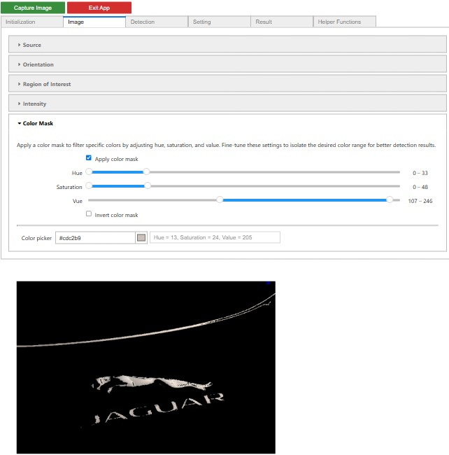
</p>

An easy way to find the right HSV values for a specific color is to use the `Color picker`. Click on the color display to open a palette where you can view the currently selected color, adjust it by typing the desired RGB (Red, Green, Blue) values, or use the sliders to fine-tune the color. You can also click the dropper icon to pick a color directly from the image. 

Once you select a color, the HSV range will automatically update — it centers around the chosen color and adds a ±20 margin for Hue, Saturation, and Value. The Color Picker also displays the current HSV values and the corresponding HEX color code, so you always have a clear reference.

A simple way of knowing what HSV values to use for a particular color is to use the `Color picker` to select the main color you want to mask. Clicking in the color display will open a color palette where you can see the current color selected and change it by typing the desired RGB (red, green, blue) values for the desired color or by sliding the color slide bar. You can also use the color dropper option by clicking in the dropper. This will allow us to pick any color from the image to use it for the color mask. Selecting a new color will automatically update the HSV value ranges by centering them at the selected color and adding a +-20 range for H, S, and V. The `Color picker` will also display at all times the HSV values of the current color selected and it’s corresponding HEX color code. 

</p>
<p align="center">

</p>

## Detection Algorithms 
In the Detection tab, start by selecting the desired detection method from the `Detection method` dropdown. Once selected, you can fine-tune the available parameters to optimize detection performance. The built-in pattern-based methods are suitable for many real-world use cases. However, for more complex scenarios—or when higher accuracy and reliability are needed—you may want to switch to AI-based detection.

### Ellipse 
The Ellipse detection method is the first option available. Ellipses have a simple geometric structure defined by just two parameters, yet they can represent a wide variety of closed curved shapes—making them a versatile choice for object detection. This method includes several parameters you can adjust to fine-tune its performance:

- `Auto detection`: Allows the system to consider incomplete edges when identifying ellipses. If unchecked, only fully closed ellipses will be detected.
- `False alarm validation`: Enables the system to statistically verify whether a detected edge is valid or a false positive. This makes detection more robust but may occasionally miss real ellipses.
- `Min path length`: Sets the minimum total edge length required for a path to qualify as a valid ellipse.
- `Min line length`: Defines the shortest individual line segment that can be part of an ellipse.
- `Blur`: Applies image blurring to reduce noise and improve detection accuracy.
- `Gradient`: Controls how strong the change in pixel values must be to be recognized as an edge. Lower values make the system more sensitive, which helps find subtle edges but may cause false positives. Higher values increase robustness, reducing noise but potentially missing faint edges.


</p>
<p align="center">

</p>

### Polygon 
The Polygon detection method can identify shapes with a configurable number of sides. It operates on a black and white version of the image, which you can view on the right-hand side of the interface. You can adjust the following parameters to fine-tune the detection:

- `Inverse`: Flips the black and white image—black becomes white and vice versa.
- `Type`: Sets the thresholding method used for image segmentation. Options include: Otsu (default), Binary, or Gaussian.
- `Threshold value`: Defines the cutoff value for distinguishing between black and white pixels in binary thresholding.
- `Smoothing blur`: Applies a blur to the image to reduce noise and improve shape detection.
- `Mean subtract`: Used in adaptive thresholding. For each pixel, the threshold is calculated as the mean of surrounding pixels minus this value.
- `Sides`: Specifies the number of sides a polygon must have to be considered valid and reported by the system.

</p>
<p align="center">
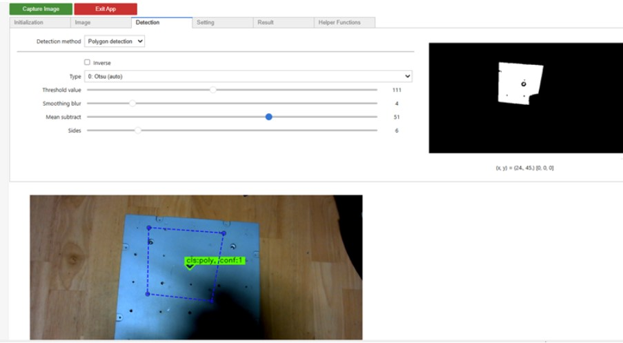
</p>

### Contour 
Contour detection is great for recognizing complex or irregular shapes that don’t fit neatly into categories like ellipses or polygons. This makes it especially useful for identifying detailed or organic-looking objects. Because it’s so flexible, it might occasionally pick up unintended shapes, which can lead to false positives. The available parameters for this method are similar to those in the `Polygon` detection.

</p>
<p align="center">
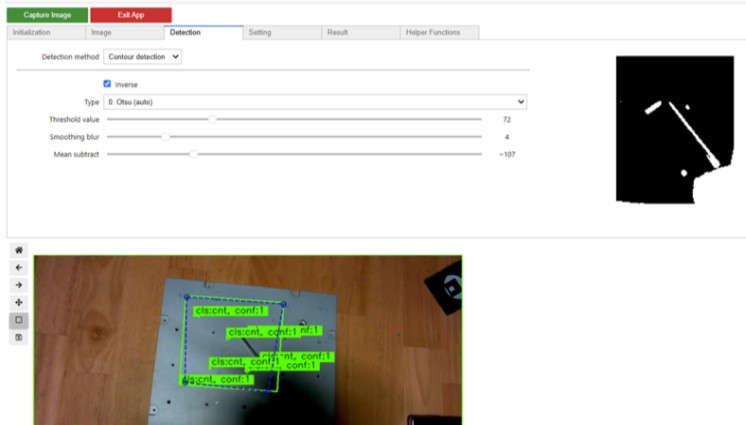
</p>

### Aruco 
Aruco markers are commonly used in vision systems thanks to their reliable and efficient detection, as well as their ability to provide precise localization and identification. Each marker carries a unique ID, which allows the system to recognize and track individual markers with high accuracy.

</p>
<p align="center">
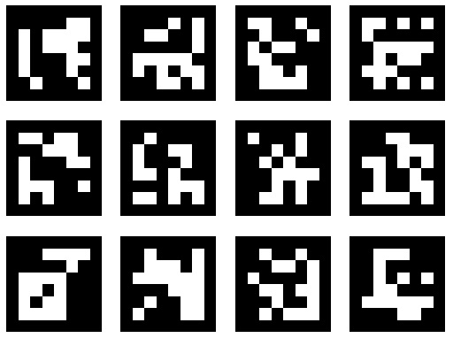
</p>

In this section, you can define the type and size of the Aruco markers. Once configured, the system will detect each marker’s position and orientation in 3D space using only 2D image input. You can control the following parameters:

- `Dictionary`: Selects which Aruco dictionary to use. Each dictionary contains a predefined set of marker patterns.
- `Marker length`:Sets the real-world length of each marker’s sides.
- `Refinement`: Specifies the refinement strategy (if any) used to enhance detection accuracy.
- `Subpixel`: Enables subpixel refinement, which increases detection precision—especially for corners—but may slightly reduce processing speed.

</p>
<p align="center">
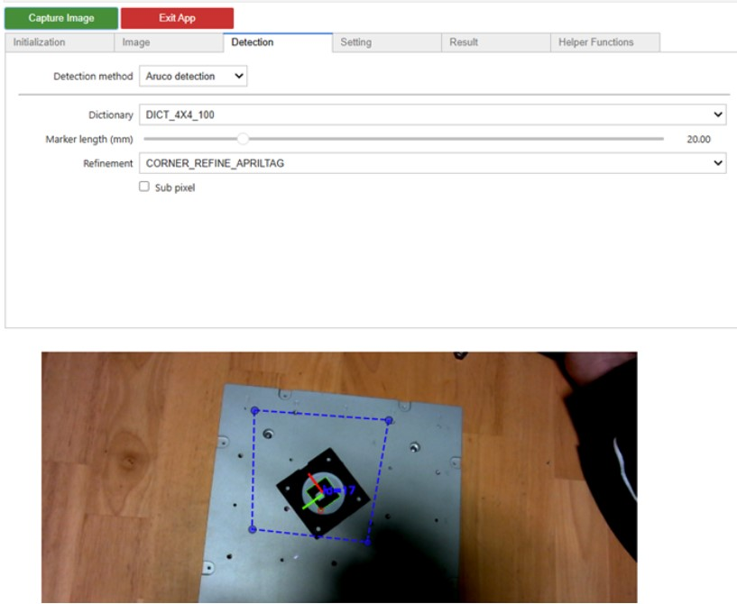
</p>

> 🚨 **Note:** It’s important to measure the real length of the marker’s sides after printing them with a precise measuring instrument such as a caliper. Providing an inaccurate marker length can cause significant errors in pose estimation.

### OCR
OCR (Optical Character Recognition) uses an AI model to detect and read text—such as letters or numbers—from images. This is especially helpful for identifying text on labels, screens, or printed materials. The AI model is pre-configured within the application and cannot be changed or customized by the user. The `Confidence` parameter Sets the minimum confidence level the model must reach before reporting detected text. Lower values may allow more text through (including incorrect guesses), while higher values increase accuracy but may miss unclear text.

</p>
<p align="center">
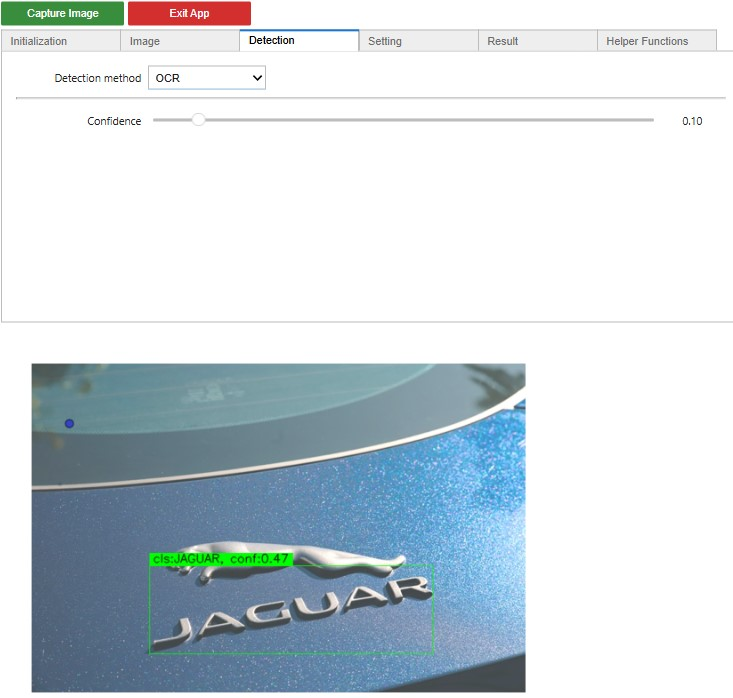
</p>

### Barcode
Barcode detection enables fast and accurate recognition of barcodes from widely used 1D and 2D standards. To set it up, simply choose the barcode format you want to detect using the `Format` dropdown. If you're unsure or want to detect any supported format, you can select `Any`, and the system will report all detected tags regardless of the standard. Specifying a format is especially helpful when multiple barcode types—like UPC-A and QR codes—might appear in the same image, but you only want to detect one of them.

</p>
<p align="center">
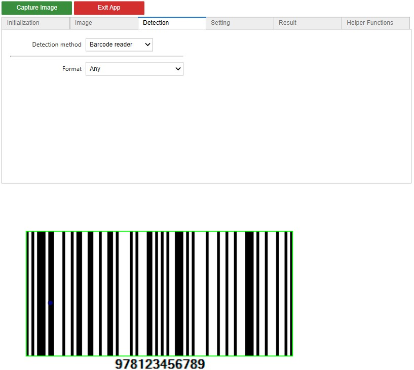
</p>

### Object Detection
This detection method will enable the system to use the AI model it was provided with during the initialization process to detect objects of interest in the image. You can control the minimum confidence level for an object detection to be reported with the `Confidence` slide bar. If the model was trained to detect objects of multiple classes and it is desired to only detect a limited set of them, you can write the names of all the desired classes separated by commas in the `Detection classes` box.

</p>
<p align="center">
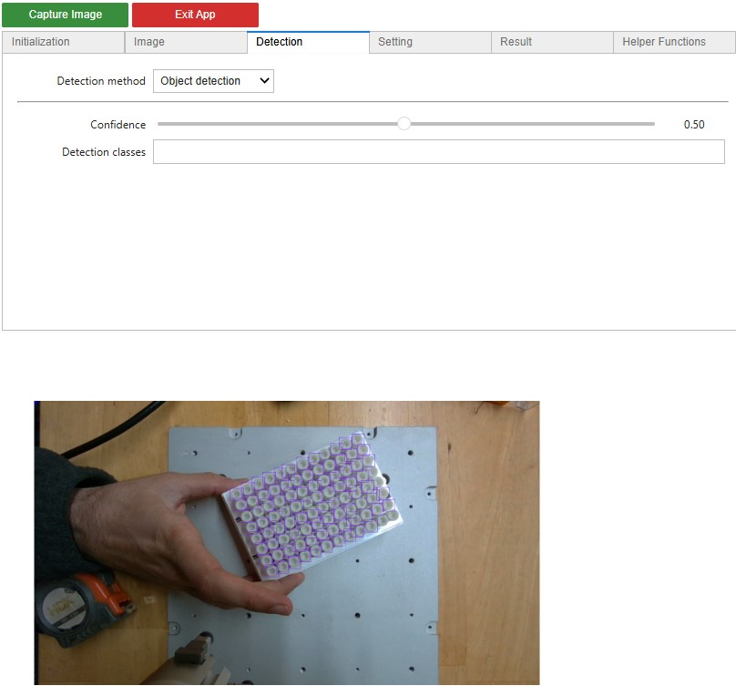
</p>

It's sometimes advantageous to use a ROI with the crop feature enabled to enhance the `Object detection` performance. By using a cropped ROI that contains the objects that you want to detect, those objects will have a higher relevance in the image that AI model will receive, potentially improving the detection results.

<div align="center">

<table>
  <tr>
    <td>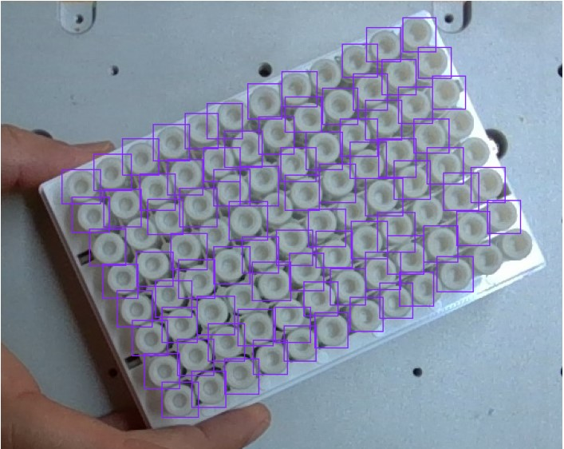</td>
    <td>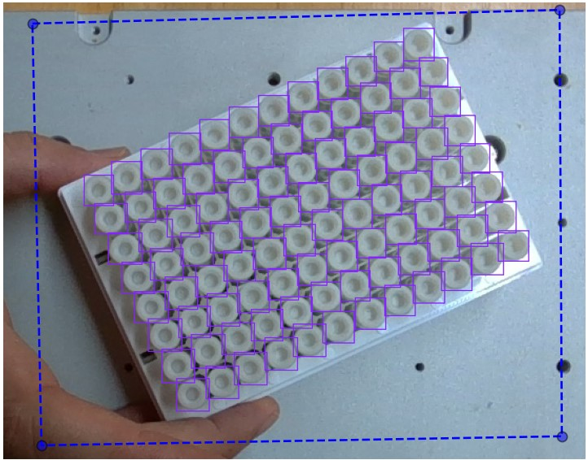</td>
  </tr>
  <tr>
    <td align="center">Original object detection</td>
    <td align="center">Object detection with cropped ROI</td>
  </tr>
</table>

</div>

### Image Classification
This will enable the system to use the AI model it was provided with during the initialization process to classify the image. Similarly, as with `Object detection`, you can control the minimum confidence level for an image class to be reported with the `Confidence` slide bar.

## Settings 

### 2D Limit 
The 2D limit setting allows you to set the range of object sizes detected by the detection algorithm based on the properties of their respective bounding box. This setting has two parameters you must set:

- `Aspect ratio`: Defines the minimum and maximum ratio between the smaller axis size to the larger axis size. 
- `Area`: The minimum and maximum number of pixels in the detected bounding box. 

</p>
<p align="center">

</p>

After the `Aspect ratio` and `Area` parameters have been set, you must check `Apply 2D constraints` to make them effective.

### 3D Limit 
The 3D Limit Settings section allows you to define a rectangular prism in the coordinate frame (as defined in the `Initialization` tab) that will be used to filter out detected objects outside of it. This setting has four parameters you must set:
- `X, Y, Z`: The minimum and maximum accepted values for the `x, y, z` dimensions. The detection algorithm will only report detected objects whose center `x, y, z` coordinates are within the prism. 
- `Invert the range`: Check to make the Vision system report the detected objects whose center are outside the defined prism instead of the ones whose center is inside of it.

</p>
<p align="center">

</p>

After the 3D Limit parameters have been set, you must check `Apply 3D constraints` to make them effective.

> 🚨 **Note:** It’s important to note that only the object’s center coordinates are used for the 3D limit filter. It’s possible to have an object not fully confined within the prism that will still be reported if its center is within the prism. 

### 6D Pose 
All detection algorithms that we discussed in the previous tab, output the 2D pixel coordinates of the detected objects (except for the Aruco detection). However, since our camera provides depth information for each pixel, it is possible to translate the output results of these detection algorithms from the 2D image space to the 3D space. 
The Dorna detection algorithm uses three key points for each instance of the detected pattern to find its pose in the 3D space. You should choose these three points so that they reside on the surface of our detected objects. 

</p>
<p align="center">
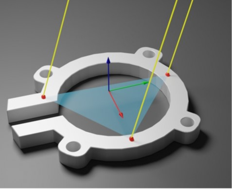
</p>

Note that the larger and shorter axes of the ellipse will get rotated and rescaled for the bounding box to match with the bounding box of the detected pattern. You should specify 3 points on this ellipse that will be mapped on your object’s surface. 

</p>
<p align="center">
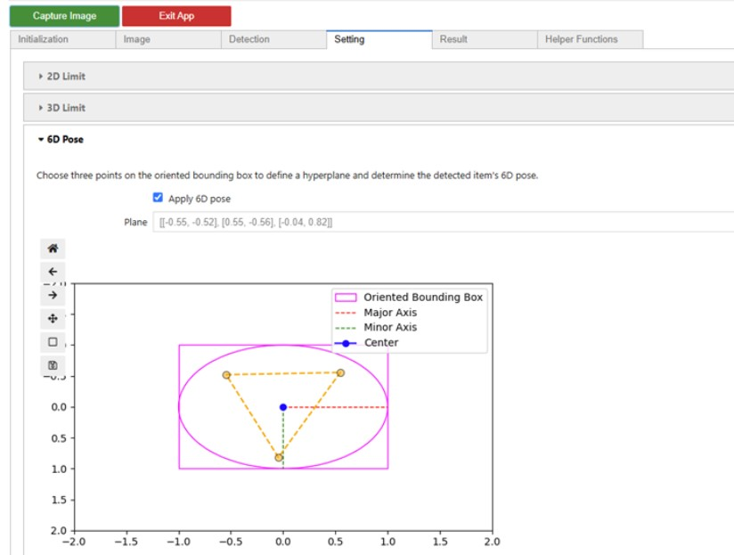
</p>

While selecting the key points on object, keep an eye on the output result below, you’ll be able to observe the yellow dots appearing on the detected pattern, this helps you find the proper place for setting the sample points. 

</p>
<p align="center">

</p>

After identifying the 2D object in the image, the detection algorithm uses the 3D coordinates of the three specified points to create a triangle in 3D space. Then, the object’s position and rotation in 3D space are determined based on the position and orientation of this triangle. 

### Output Format 
This section lets you customize how the detection algorithm's results are returned:

- `Max detections per run`: Sets the maximum number of detections the algorithm will return. The default is 1.
- `Shuffle return data`: If enabled, the algorithm will randomly shuffle the list of detected objects each time it runs.
- `Save the annotated image`: Saves an image with visual annotations of the detected objects. This can be useful for debugging, but it’s generally recommended to keep it off unless needed — storing too many images can quickly consume memory. You can also use this feature to collect training data for machine learning.
- `Save the annotated ROI image`: Save the ROI image.

</p>
<p align="center">
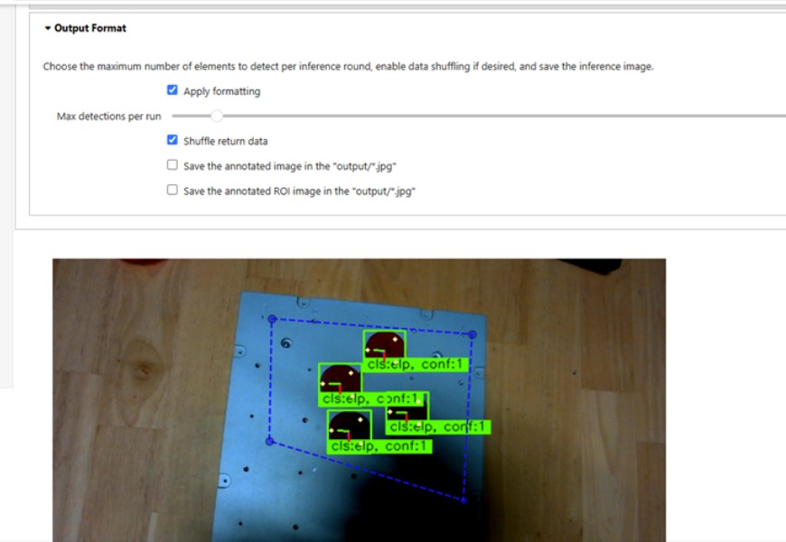
</p>

## Results 
The Application Builder is a tool for setting up the detection algorithm in a way that suits your tasks. Our final goal would be to extract detection results from the algorithm and use it for decision making in robotic applications. In the result tab, you can find what is needed for this task. 

</p>
<p align="center">
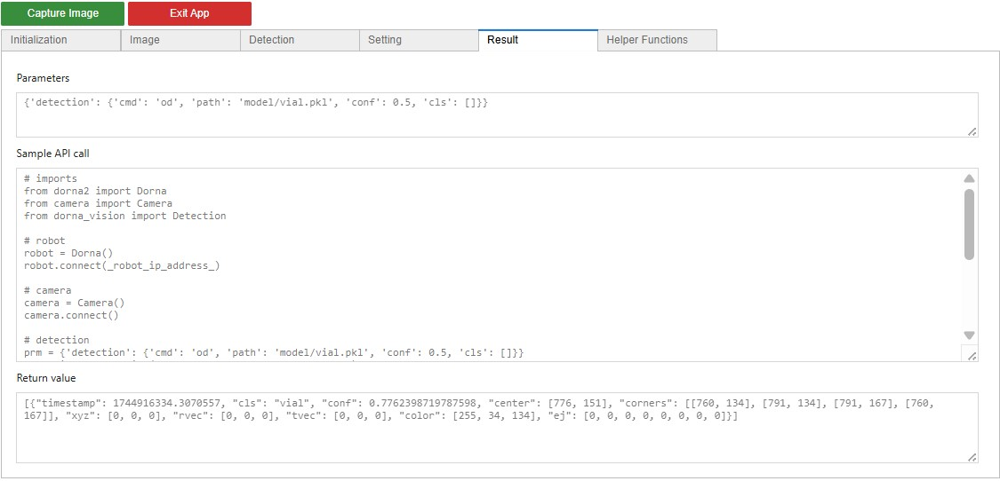
</p>

### Parameters
The `Parameters` box displays the contents of the `prm` dictionary. This dictionary holds all the configuration values defined by the user through the Detection App — essentially capturing every parameter needed to run the selected detection algorithm.

### API Call 
The API call is the Python code you need to run in your program to initialize the camera and detection algorithm and execute the detection process. First, you set up the robot and detection objects. Then, a variable called `prm` is created — this contains all the parameters based on the configuration you selected in the application. Finally, the detection function is called using `prm` as input, and the detected results are returned in the `retval` variable.

> 🚨 **Note:** The API calls can be executed as many times as needed within a program. As long as the required `Camera Mounting`, `Frame` and `AI Models` parameters don’t change, only one initialization is required.

### Return

The `retval` is a list of dictionaries, where each dictionary contains the details of one detected object. Each dictionary includes the following fields:

- `timestamp`: Indicates the time when the image was captured or loaded expressed in seconds. For the `Stereo camera` source, it’s the time the image was taken. For the `File` source, it’s the time the file was opened.
- `cls`: The class or type of the detected object. Examples: "cnt" for contours, "poly" for polygons. For OCR, this will be the actual detected text. For `Object detection` or `Image classification`, it will be the class detected by the AI model.
- `conf`: A confidence score showing how sure the algorithm is about the detection. This is mainly relevant for AI/ML-based methods, not used for classical detection methods (like ellipses or polygons).
- `center` and `corners`: Geometrical coordinates of the object’s bounding box expressed in pixels. Coordinates start from the top-left corner of the image.
- `xyz`: The 3D position (in space) of the detected object, calculated based on the center pixel. 
- `tvec` and `rvec`: The translation (`x, y, z`) and rotation (`a, b, c`) values representing the object's 6D pose.
- `color`: The color of the object’s bounding box, given in BGR (Blue, Green, Red) format.

## Helper Functions 

### Pixel to XYZ 
This function lets you extract the 3D coordinates of any pixel on the image. It’s a quick and useful way to verify whether the camera setup and initialization parameters have been configured correctly.

# Upgrade the Software

To upgrade the vision kit software, SSH into the vision kit and run the following command:

```bash
sudo mkdir -p /home/dorna/Downloads && sudo rm -rf /home/dorna/Downloads/upgrade && sudo mkdir /home/dorna/Downloads/upgrade && sudo git clone -b vision https://github.com/dorna-robotics/upgrade.git /home/dorna/Downloads/upgrade && cd /home/dorna/Downloads/upgrade && sudo sh setup.sh dorna_ta
```
> 🚨 **Note:** Before trying to upgrade, make sure the Vision controller is connected to the internet. This can be done by connecting it directly to your router, SSH into it, and running the command ifconfig. If the controller is connected to the internet, running this command will display the controller’s IP address.

# Troubleshooting and Resolving Common Issues

## 1. Running Multiple Detection Sessions
You cannot run multiple sessions of the detection app at the same time. If you are done with a detection session and need to start a new one, you should kill the existing kernel in Jupyter Notebook. To do this:
- Go to the **Jupyter Notebook** interface.
- In the **"Running"** tab, you will see a list of active notebooks.
- Find the notebook running the detection app.
- Click the **"Shutdown"** button next to the notebook to kill the kernel and stop the session.

This will free up resources for a new session.

## 2. Camera Not Responsive
If the camera is not responsive, follow these steps:
- Disconnect and reconnect the USB cable from the vision kit side.
- After reconnecting, kill the Jupyter session running the program by following the steps above.
- Re-run the program by restarting the Jupyter notebook.

This should resolve any camera connectivity issues and allow the detection app to function properly again.
