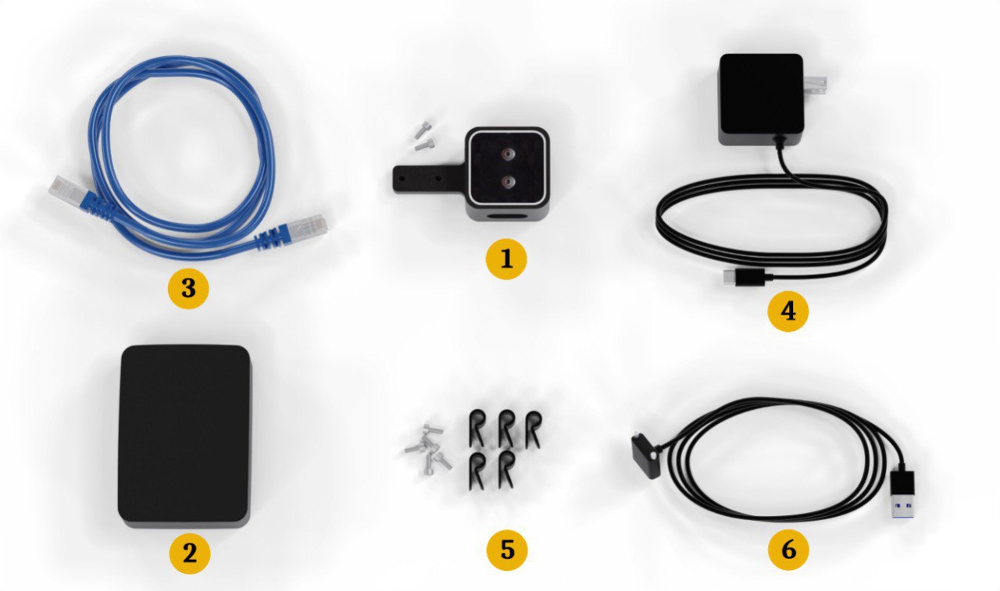
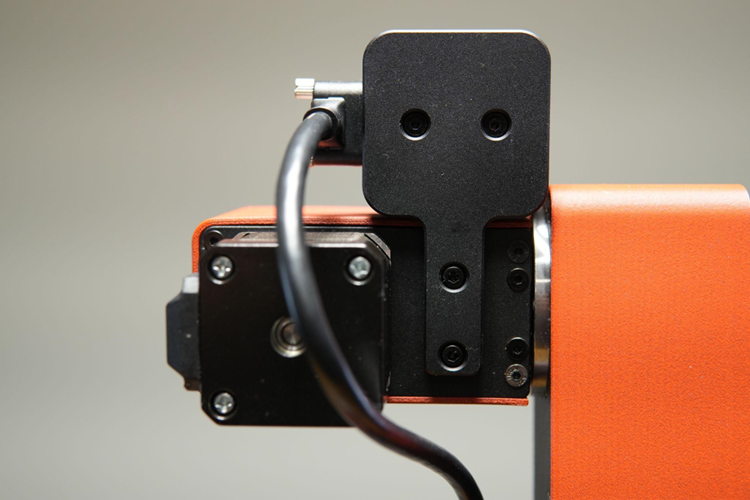

## Table of Contents

- [Introduction ](#introduction)

# Introduction
In this guide, we introduce the Dorna Vision Kit and cover the fundamentals of using vision in automation projects.

# Items Included
<p align="center">
  
</p>

1. 3D camera and mounting plate 
2. Vision kit computer
3. Ethernet cable
4. Power supply
5. Cable guide brackets
6. USB cable

# Installation Instructions

1. **Attach the Camera**  
   Mount the camera and its plate onto the robot. Align the two holes on the mounting plate with the holes on the robot’s 5th axis body and secure them. Make sure the camera plate is straight and not tilted.
   <p align="center">
   
   </p>

2. **Route the USB Cable**  
   Plug the USB cable into the robot's USB port. Ensure the screws on the USB connector are securely fastened to prevent loose connections.

3. **Connect the USB Cable to the Vision Kit**  
   Pass the USB cable to the vision kit and insert it into one of the blue USB 3.0 ports (blue USB ports).
   <p align="center">
   
   </p>

4. **Organize the USB Cable**  
   Use the cable guides to route the USB cable neatly. Ensure the cable does not obstruct the robot’s movement or become tangled.
   <p align="center">
   
   </p>
   <p align="center">
   
   </p>
5. **(Optional) Set Up the Ethernet Splitter**  
   - To minimize the number of Ethernet cables running between devices, use the Ethernet splitter.  
   - Place the robot controller, vision kit, and splitter close together for easy connection.  
   - Connect the robot controller and vision kit to the splitter using the provided short Ethernet cables. Plug these cables into the two Ethernet ports on the splitter (the side with two ports).  
   - Connect an Ethernet cable from the single-port side of the splitter to your computer or router.  
   - Power the splitter by connecting its USB cable to one of the gray USB 2.0 ports on the vision kit.

6. **Power the Vision Kit**  
   Connect the USB-C power supply cable to the vision kit computer and plug the other end into a wall outlet.

> 🚨 **Notice:** Ensure all connections, including the camera and cables, are properly set up before turning on the vision kit.

# Connect to the Vision Kit

The vision kit is equipped with a single-board computer running a 64-bit Debian-based Linux distribution to execute your vision applications. The default hostname, username, and password for the vision kit are as follows:

```bash
# hostname
vision

# username
dorna

# password
dorna
```

## Configuring IP Address

If the vision kit is connected to a router with a DHCP server, the IP address will be automatically assigned. If it is connected directly to your computer via the Ethernet port, you will need to manually configure the IP address.

1. **SSH into the Vision Kit**  
   Open a terminal and use the following command to SSH into the vision kit (log in with the password `dorna`):

    ```bash
    ssh dorna@vision.local
    ```

2. **Open the Network Configuration Tool**  
   Type the following command to open the network configuration interface:

    ```bash
    sudo nmtui
    ```

3. **Edit the Connection**  
   - Select `Edit a connection`.
   - Choose the relevant connection type (e.g., `Wired connection 1`).

4. **Configure the IPv4 Settings**  
   - Set `IPv4 CONFIGURATION` to `Manual`.
   - Enter the following details:
     - `Address`: Assign a static IP address to the vision kit (e.g., `192.168.1.100`).
     - `Gateway`: Enter the gateway address (typically your router's IP address, e.g., `192.168.1.1`).
     - `DNS`: Use a DNS server address, such as `8.8.8.8` (Google's public DNS).

5. **Save the Configuration**  
   - Click `OK` to save your settings.
   - Press <Back> and then <OK> to exit the configuration tool.

6. **Reboot the Vision Kit**  
   Type `sudo reboot` to reboot the vision kit and apply the changes.

> 🚨 **Note:** If the vision kit is connected to a router with a DHCP server, the IP address will be assigned automatically by the router.

## Accessing Dorna Lab
To access the Dorna Lab software, enter the vision kit's IP address in your web browser by typing 
```bash
http://vision_kit_ip_address
```  
To connect to a robot from the Dorna Lab session, follow these steps:
1. Click on `Settings` in the top navbar.
2. Go to `General Info`.
3. Under `Robot System IP`, enter the robot's IP address.
4. Click `Set`.

# Detection App

The vision kit comes with a built-in **detection app** software which lets you to visually build your vision applications directly from a web browser. The detection app  generates the necessary API calls for you. You can then use these generated calls within your code to perform object detection, simplifying the process and integrating detection capabilities seamlessly into your applications.

To access the detection app, navigate to:
```bash
http://vision_kit_ip_address:8888/doc/workspaces/auto-g/tree/Downloads/vision/example/detection_app.ipynb
```

Alternatively, access Dorna Lab via the Vision Kit, open a new Python3 kernel in Jupyter Notebook and run the following code:
```python
%matplotlib widget
from dorna_vision import Detection_app
x = Detection_app()
```
</p>
<p align="center">

</p>

## Initialization
The first tab in the detection app is called Initialization.

### Camera mounting
Here we first choose the type of camera mounting:
1. **Eye-in-hand**: The configuration where the camera is installed on the robot is called the **Eye-in-hand** configuration. This allows the robot to have a dynamic viewpoint, providing real-time visual feedback from the perspective of the tool or the gripper.
2. **Eye-to-hand**: Another configuration, where the camera is installed at a fixed location and not on the robot, is called **Eye-to-Hand**.

The default configuration for Dorna vision kit is the eye-in-hand configuration.
For the eye-in-hand configuration to work properly, the vision processor needs to know the position of the robot when it takes the image. For that the robot and vision processor need to communicate with each other. We enter the ip address of the robot here so the vision processor can communicate with the robot controller.  
We will not use custom calibration data for the camera here.
</p>
<p align="center">

</p>

> 🚨 **Note:** The eye-in-hand configuration only works for the Dorna TA model.

## Frame
Frame is the coordinate system that when specified, all the reported positions of the detected objects are reported with respect to it. The frame can be specified with 6D pose values of `x, y, z, a, b, c` where `x, y, z` are the translation vector and `a, b, c` are representing the orientation of the frame in the reference frame.
The definition of this frame is slightly different in the two cases Eye-in-hand and Eye-to-hand.


# Upgrade the Software

To upgrade the vision kit software, SSH into the vision kit and run the following command:

```bash
sudo mkdir -p /home/dorna/Downloads && sudo rm -rf /home/dorna/Downloads/upgrade && sudo mkdir /home/dorna/Downloads/upgrade && sudo git clone -b vision https://github.com/dorna-robotics/upgrade.git /home/dorna/Downloads/upgrade && cd /home/dorna/Downloads/upgrade && sudo sh setup.sh dorna_ta
```

# Troubleshooting and Resolving Common Issues

## 1. Running Multiple Detection Sessions
You cannot run multiple sessions of the detection app at the same time. If you are done with a detection session and need to start a new one, you should kill the existing kernel in Jupyter Notebook. To do this:
- Go to the **Jupyter Notebook** interface.
- In the **"Running"** tab, you will see a list of active notebooks.
- Find the notebook running the detection app.
- Click the **"Shutdown"** button next to the notebook to kill the kernel and stop the session.

This will free up resources for a new session.

## 2. Camera Not Responsive
If the camera is not responsive, follow these steps:
- Disconnect and reconnect the USB cable from the vision kit side.
- After reconnecting, kill the Jupyter session running the program by following the steps above.
- Re-run the program by restarting the Jupyter notebook.

This should resolve any camera connectivity issues and allow the detection app to function properly again.
